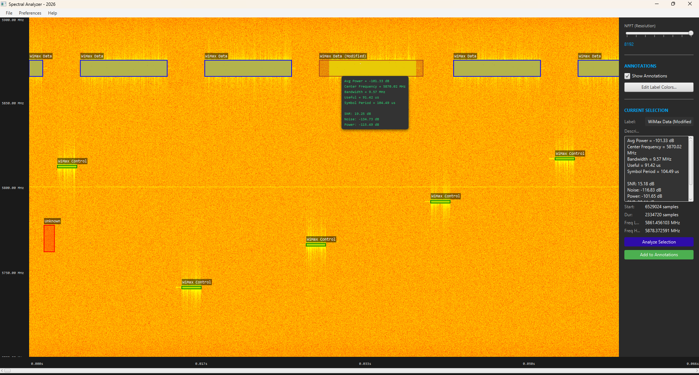
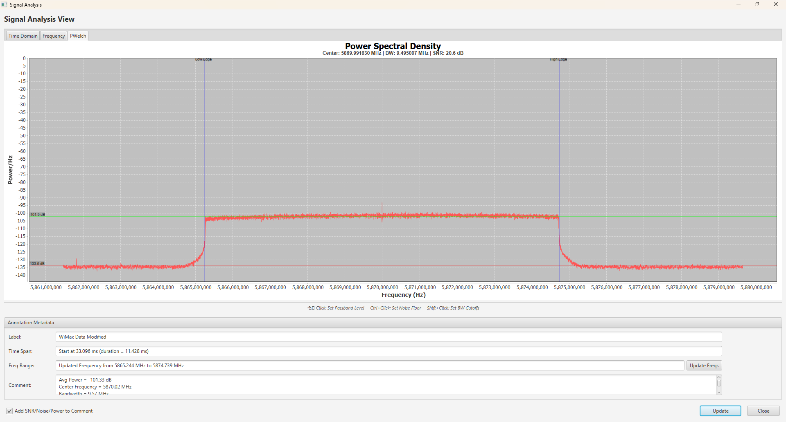

# Spectral Analyzer

The Spectral Analyzer is a JavaFX application to load and analyze SigMF datasets.  The main view shows the spectrogram of the input signal along with the annotations list.  Custom color mappings can be applied to highlight various signals of interest.

The Spectral Analyzer allows the user to select time/frequency blocks and manually add new annotations.  It supports launching an analysis dialog to operate on a downconverted signal to refine the frequency boundaries and get user-aided estimates (passband power, noise floor and SNR measurements).

* External to this project
  * Used an energy detector to isolate the signals
  * An OFDM parameter estimate was performed to estimate the useful symbol period and symbol period.
* Internal
  * I loaded a JSON file to specify the color scheme for the data and control channels.
  * I manually added an `Unknown` signal annotation shown in red.
  * I deleted one of the `WiMax Data` annotations and created a modified annotation.  I used the analysis to get the power measurements.  The `comment` part of the annotation is displayed as a tool tip or on the right when I select the annotation.

* The PSB tab of the `Analysis Dialog` is shown below.  This takes user input
  * User selects Passband with standard mouse `Click`.
  * User selects Noise Floor with `Ctrl + Click`.
  * User selects low and high frequency with `Shift + Click`.
  * `Update frequency` button will apply user selected bandwidth if the frequencies are selected.
  * If passband and noise floor are selected, and the `Update` button is pressed, the annotation is updated with measurements of the passband and noise floor average power and the estimate SNR.

## Installation

### Install Java

This project is implemented in Java 21.

~~~bash
  # install JDK 21 (on Ubuntu)
  sudo apt install openjdk-21-jdk -y

  # verify that it is installed
  javac --version
~~~

### Install Project

~~~bash
    # ===============================================================
    # Test the build
    # ===============================================================
    # build the application and run test
    ./gradlew build check

    # ===============================================================
    # Run in Development
    # ===============================================================
    # run from gradle (for development purposes)
    # NOTE: uses incremental build
    ./gradlew run

    # ===============================================================
    # Build
    # ===============================================================
    # build a Spring Boot JAR
    ./gradlew bootJar

    # ===============================================================
    # Run in Development
    # ===============================================================
    java -jar .\build\libs\spectral_analyzer-$VERSION.jar
~~~

### Dependencies

| Library | License | Description |
| :-: | :-: | :-: |
| [Apache Common Math 3 v3.6.1]() | Apache License 2.0 | Provides FFT and complex number math |
| [EJML](https://github.com/lessthanoptimal/ejml) | Apache License 2.0 | A dependency of JDSP |
| [Jackson Databind](https://github.com/FasterXML/jackson-databind) | Apache License 2.0 | JSON mapping to support read/write SigMF meta files |
| [JDSP v1.2](https://github.com/GassiusODude/jdsp) | MIT | DSP library support resampling, frequency shift, and filtering |
| [JFreeChart](https://github.com/jfree/jfreechart) | LGPL-2.1 |  The core charting engine for generating high performance 2D plots |
| [JFreeChart-FX](https://github.com/jfree/jfreechart-fx) | LGPL-2.1 | Bridge library that enables JFreeChart to render within the JavaFX Scene Graph |
| [Spring Boot](https://github.com/spring-projects/spring-boot) | Apache License 2.0 | Provides application framework, dependency injection, and automated configuration management |
| [Spring Framework](https://github.com/spring-projects/spring-boot) | Apache License 2.0 | The foundational framework providing core inversion of control (IoC) and event-handling capabilities |

**Open Source & LGPL Compliance**

This project is open source and is intended to be fully compliant with the GNU Lesser General Public License (LGPL).

* Relinking & Modification:
  * Because the source code for this entire project is publicly available, users may freely modify the build.gradle file to use different versions of the LGPL libraries (such as JFreeChart) and recompile the application using Gradle.
* Combined Work
  * This application is a "combined work" under the terms of the LGPL. It links to the libraries listed in the table above but does not include modified source code from those libraries within its own packages.
* No Restrictions
  * We do not use any technical measures (such as hardware locking or code obfuscation) to prevent users from running modified versions of the LGPL libraries with this software.