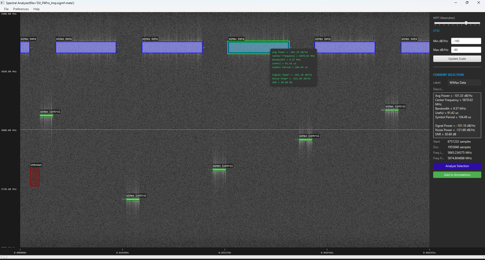
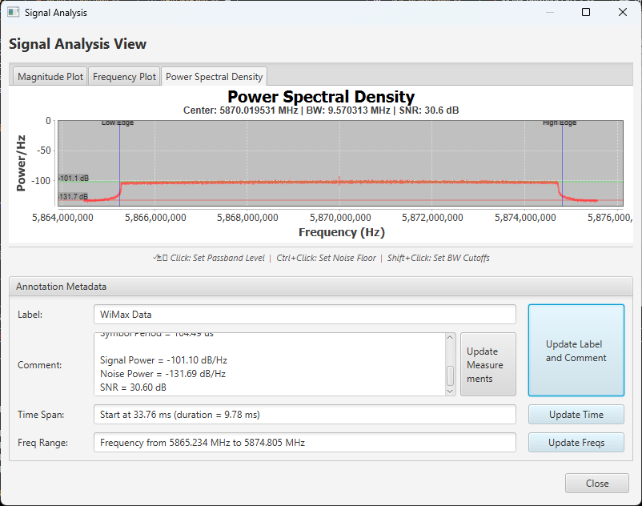
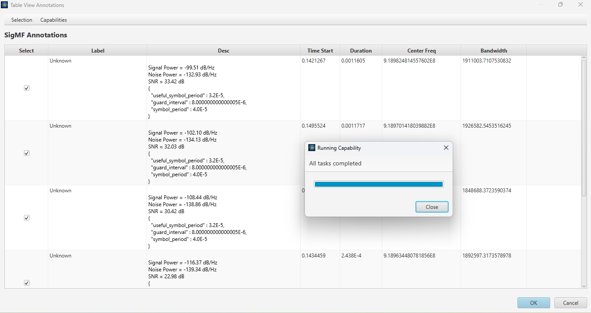

# Spectral Analyzer

The Spectral Analyzer is a JavaFX application to load and analyze SigMF datasets.  The main view shows the spectrogram of the input signal along with the annotations list.  Custom color mappings can be applied to highlight various signals of interest.

## Installation

### Install Java

This project is implemented in Java 21.  Make sure to install a Java Runtime to run the application, or the JDK to work with the source code.

~~~bash
  # install JDK 21 (on Ubuntu)
  sudo apt install openjdk-21-jdk -y

  # verify that it is installed
  javac --version
~~~

### Install Project

~~~bash
    # ===============================================================
    # Test the build
    # ===============================================================
    # build the application and run test
    ./gradlew build check

    # ===============================================================
    # Run in Development
    # ===============================================================
    # run from gradle (for development purposes)
    # NOTE: uses incremental build
    ./gradlew run

    # ===============================================================
    # Build (bootJar)
    # ===============================================================
    # build a Spring Boot JAR
    # NOTE: on linux, may append "-boot" to the name.
    ./gradlew bootJar

~~~

## Running

Before running, make sure the Java Runtime is installed ([Install Java](#install-java))

After building the bootJar or pulling the Jar from the release, you can run the program with the following:

~~~bash
    # ===============================================================
    # Run Deployment (from the bootJar)
    # ===============================================================
    # NOTE: make sure the correct OS version is selected (Windows vs Linux)
    java -jar .\build\libs\spectral_analyzer-$VERSION.jar
~~~

### Spectrogram View

The Spectral Analyzer starts with the spectrogram view and allows the user to select time/frequency blocks and manually add new annotations.  It supports launching an analysis dialog to operate on a downconverted signal to refine the time/frequency boundaries and get user-aided estimates (passband power, noise floor and SNR measurements).

* Apply a JSON color config file to specify the color scheme to apply to unique annotation labels.
* Select an annotation for user analysis
  * Click annotation to select
  * Click the 'Analyze Selection` button to go into [Annotation Analysis](#annotation-analysis)
* Apply REST Capability
  * Run `Capabilities > Connect to a REST server` menu item
    * The default address is set to a local FastAPI deployment (http://localhost:8000/openapi.json)
  * Apply the capability to the selected annotation.
  * This applies the capability asynchronously.  The results will then be displayed in a pop-up dialog.  The contents can be copied and used to update the annotation.
  * Some REST services go to sleep when idle.  This is one way to wake the service.
  * Since the capability may take a while, this approach allows testing capabilities.  It does not try to save results automatically to the annotation (as the user may have removed the annotation before the result comes back.)
* Enter [Table View](#table-view)
  * This is a table to review the annotations in the file.
  * Supports modifying annotations.
  * Supports running batches of annotations through the capabilities.  The capabilities are run synchronously and will update the information in the table view.  User selection of `OK` is needed to save update from the table back to the annotations.  And then saving the modifified annotations through the `File > Save Signal` menu item.

### Annotation Analysis

* The PSD tab of the `Analysis Dialog` is shown below.  This takes user input:
  * I used the analysis to get the power measurements.  The `comment` part of the annotation is displayed as a tool tip or on the right when I select the annotation.
  * User selects Passband with a standard mouse `Click`.
  * User selects Noise Floor with `Ctrl + Click`.
  * User selects low and high frequency with `Shift + Click`.
  * `Update Freqs` button will apply user selected bandwidth if the frequencies are selected.
  * `Update Time` button will apply user selected time (selected in magnitude or frequency plots)
  * If user selected passband and noise floor, the `Update Measurements` will append the measurements to the comment text area (the annotation itself has not been updated yet.  Hit `Update Label and Comment` to apply modifications to those fields back to the annotation at hand.)

### Table View

The table view can be entered from `View > Table View`.  This supports reviewing the annotations and modifying it.

* Sort by time start, duration, bandwidth or center frequency.
* Review neighboring annotations (sort by time).
* Support modifying Label or Description to improve consistency.
* Support calling REST capabilities on a batch of selected annotations.
  * This differs from the usage from the [Spectrogram View](#spectrogram-view).  It runs the capability synchronously and maintains the modality of the dialog box to avoid the user removing an annotation that is being analyzed.  With this, the responding text is updated into the table.  This is not saved to the SigMF unless the `OK` button is clicked.  `Cancel` will drop modifications made in the table.
  * Modifications to the annotations still require a save from the Spectrogram View to save updates into the SigMF meta file.

## Dependencies

| Library | License | Description |
| :-: | :-: | :-: |
| [Apache Common Math 3 v3.6.1]() | Apache License 2.0 | Provides FFT and complex number math |
| [EJML](https://github.com/lessthanoptimal/ejml) | Apache License 2.0 | A dependency of JDSP |
| [Jackson Databind](https://github.com/FasterXML/jackson-databind) | Apache License 2.0 | JSON mapping to support read/write SigMF meta files |
| [JDSP v1.2](https://github.com/GassiusODude/jdsp) | MIT | DSP library support resampling, frequency shift, and filtering |
| [JFreeChart](https://github.com/jfree/jfreechart) | LGPL-2.1 |  The core charting engine for generating high performance 2D plots |
| [JFreeChart-FX](https://github.com/jfree/jfreechart-fx) | LGPL-2.1 | Bridge library that enables JFreeChart to render within the JavaFX Scene Graph |
| [Spring Boot](https://github.com/spring-projects/spring-boot) | Apache License 2.0 | Provides application framework, dependency injection, and automated configuration management |
| [Spring Framework](https://github.com/spring-projects/spring-boot) | Apache License 2.0 | The foundational framework providing core inversion of control (IoC) and event-handling capabilities |

**Open Source & LGPL Compliance**

This project is open source and is intended to be fully compliant with the GNU Lesser General Public License (LGPL).

* Relinking & Modification:
  * Because the source code for this entire project is publicly available, users may freely modify the build.gradle file to use different versions of the LGPL libraries (such as JFreeChart) and recompile the application using Gradle.
* Combined Work
  * This application is a "combined work" under the terms of the LGPL. It links to the libraries listed in the table above but does not include modified source code from those libraries within its own packages.
* No Restrictions
  * We do not use any technical measures (such as hardware locking or code obfuscation) to prevent users from running modified versions of the LGPL libraries with this software.